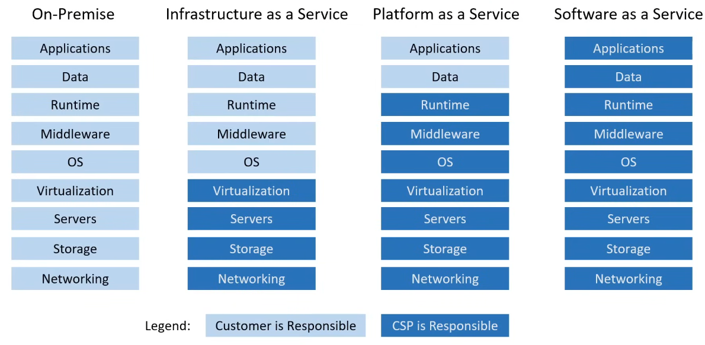
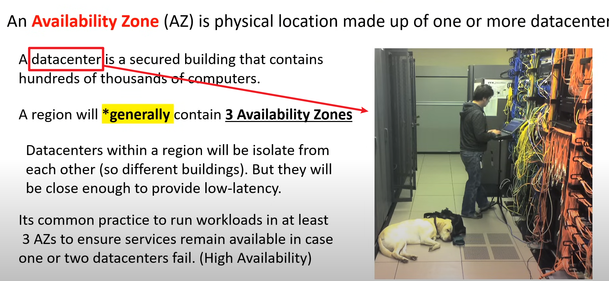

# Microsoft Azure Fundamentals

### Question Types
- Multiple Choice
- Multiple Select
- Drag and Drop
- Build List Reorder
- Active Screen
- Hot Area
- Case Study

### Common Cloud Service
- Compute
- Storage
- Networking
- Databases

### Benefits of Cloud Computing
- Const-effective
- Globbal
- Secure
- Reliable
- Scalable
- Elastic

### Types of Cloud Computing
- SaaS: Software as a Services (for customers), Visual Studio, Gmail, Microsoft 365
- PaaS: Platform as a Service (for developers), Microsoft Azure App Service
- IaaS: Infrastructure as a Service (for admins), Microsoft Azure

### Types of Cloud Computing Responsibilities

### Deployment Model
- Public Cloud
- Private Cloud
- Hybrid Cloud (both Public Cloud and Private Cloud)
- Cross-Cloud / Multi-Cloud (various cloud service providers)

### CAPEX vs OPEN
- CAPEX: Capital expenditure, spending money upofront on physical infrastructure
- OPEX: Operating expenditure

### Scaling up & Scaling out & Scaling In
- scaling up: upgrade or expand the server (vertical scaling)
- scaling out: add more servers of the same size (horizontal scaling)
- scaling in: remove more servers of the same size (horizontal scaling)

### High Elasticity
- Azure MV Scale Sets
- SQL Server Stretch Database

### High Fault Tolerant
- Fail-overs: shift traffic to a redundant system in case the primary system fails
- Azure Traffic Manager: a DNS-based traffic balancer

### High Durability
- the ability to recover from a disaster and prevent the loss of data
- Disaster Recovery (DR)

### Business Continuity Plan (BCP)
- Recovery Point Objective (RPO): 
> - The maximum acceptable amount of **data loss** after an unplanned data-loss incident, expressed as an amount of time
> - How much data are you willing to lose?
- Recovery Time Objective (RTO)
> - The maximum amount of downtime the business can tolerate without incurring a significant financial loss
> - How much time are you willing to go down?

### Disaster Recovery Options
From cold to hot (cheap to expensive)
- Backup & restore
> - you backup your data and restore it to new infrastructure
> - Hours
- Pilot Light:
> - data is replicated to another region with the minimal services running
> - 用于保护关键业务应用程序和数据免受故障或灾难事件的影响。"pilot light" 的概念类似于备用灯（Pilot Light），意味着在灾难发生时，只保留必要的最小化基础设施和资源运行，以确保关键系统的快速恢复。
> - 10 mins
- Warm Standby
> - **scaled down** copy of your infrastructure running ready to **scale up**
> - 用于保护关键业务应用程序和数据免受故障或灾难事件的影响。相对于 "pilot light" 策略，"warm standby" 策略提供了更快的恢复时间，因为备用系统处于部分运行状态。
> - mins
- Multi-site Active
> - scaled up copy of your infrastructure in another region
> - 这种策略通过在多个地理位置（通常是不同的数据中心或地区）部署活动（Active）系统来实现高可用性和灾难恢复能力。
> - real-time

### Global Infrastructure
- Regions
> - A region is a grouping of multiple datacenters (AZ).

> - Not all Azure cloud services are available in every region
> - In Azure, an "alternate region" refers to a backup region, also known as a secondary data center or alternate location. The alternate region is a service designed to enhance business continuity and disaster recovery. It allows services or applications to be switched to the alternate region when the primary region becomes unavailable due to a failure or outage.
> - Specifically, the alternate region is typically located far away from the primary region, in a different geographical location or data center. This ensures that the alternate region remains unaffected and continues to provide services when a regional failure or disaster occurs in the primary region. The alternate region usually replicates the data and services from the primary region and remains synchronized with it, enabling quick failover and service recovery when a failure happens.
- Geographies
> A geography is a discreet market of two or more regions that preserves **data residency** and **compliance boundaries**.
- Availability Zone (AZ)

    - Fault Domain  
    A logical grouping of hardware to avoid a single point of failure within an AZ
    - Update Domain
    Azure may need to apply updates to the underlying hardware anmd software. Update domians ensure your resource do not go offline.

[tutorial](https://www.youtube.com/watch?v=5abffC-K40c)  1:24:06