# Personal Knowledge Base

### Table of Contents
| No. | Questions |
| --- | --------- |  
| *   | [What is SCSS](#what-is-scss)  |
| *   | [What is Entity Framework Core](#what-is-entity-framework-core)  |
| *   | [What is CMS](#what-is-sitecore)  |
| *   | [What is Nextjs](#what-is-nextjs)  |
| *   | [Bundle and minify static assets in ASP.NET Core](#bundle-and-minify-static-assets-in-aspnet-core)  |
| *   | [What is ASP.NET MVC](#what-is-aspnet-mvc)  |
| *   | [Common HTML Events](#common-html-events)  |
| *   | [Content Delivery API](#content-delivert-api)  |


### What is SCSS?

#### Sass and SCSS
Sass (Syntactically Awesome Stylesheets) is a powerful CSS extension language that provides many useful features such as variables, nesting rules, mixins, inheritance, etc. to help you write CSS more efficiently.

SCSS is a syntax for Sass, and it is the latest version of Sass.SCSS is fully compatible with the CSS syntax, which means that any valid CSS code is valid SCSS code.SCSS files are usually saved with a .scss extension.
The older syntax of Sass (i.e., the "indentation syntax"), called Sass for short and with a .sass file extension, uses indentation rather than curly braces to separate blocks of code, and uses new lines rather than semicolons to separate rules.

#### Comparison of the two:
- CSS is the foundation; it's the standard language for styling web pages.
- Sass adds many programming features to CSS to make your CSS more dynamic and reusable.
- SCSS is a syntax model of Sass that is closer to CSS and is easier to understand and adopt.

#### Variables
Think of variables as a way to store information that you want to reuse throughout your stylesheet. You can store things like colors, font stacks, or any CSS value you think you’ll want to reuse. Sass uses the $ symbol to make something a variable. Here’s an example:

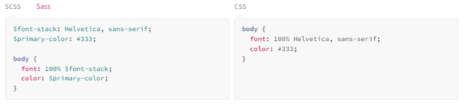

#### Nesting
When writing HTML you’ve probably noticed that it has a clear nested and visual hierarchy. CSS, on the other hand, doesn’t.

Sass will let you nest your CSS selectors in a way that follows the same visual hierarchy of your HTML. Be aware that overly nested rules will result in over-qualified CSS that could prove hard to maintain and is generally considered bad practice.

With that in mind, here’s an example of some typical styles for a site’s navigation:

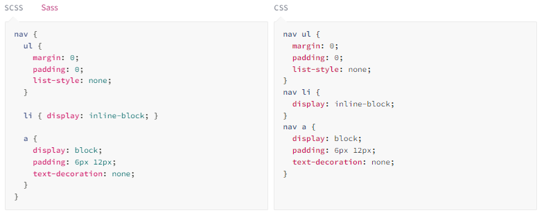

#### Modules

You don’t have to write all your Sass in a single file. You can split it up however you want with the @use rule. This rule loads another Sass file as a module, which means you can refer to its variables, mixins, and functions in your Sass file with a namespace based on the filename. Using a file will also include the CSS it generates in your compiled output!

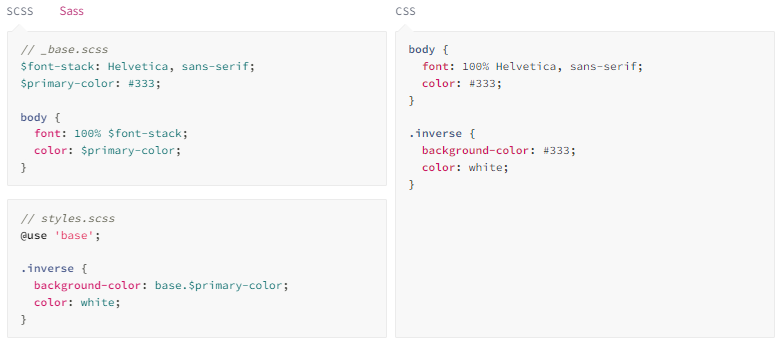

#### Mixins

Some things in CSS are a bit tedious to write, especially with CSS3 and the many vendor prefixes that exist. A mixin lets you make groups of CSS declarations that you want to reuse throughout your site. It helps keep your Sass very DRY. You can even pass in values to make your mixin more flexible. Here’s an example for theme.

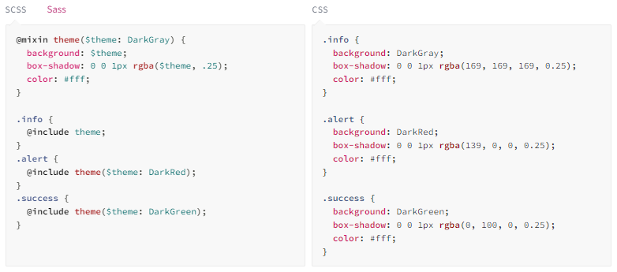

#### Extend/Inheritance

Using @extend lets you share a set of CSS properties from one selector to another. In our example we’re going to create a simple series of messaging for errors, warnings and successes using another feature which goes hand in hand with extend, placeholder classes. A placeholder class is a special type of class that only prints when it is extended, and can help keep your compiled CSS neat and clean.

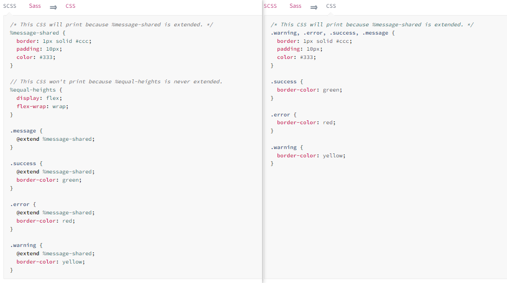

#### Operators

Doing math in your CSS is very helpful. Sass has a handful of standard math operators like +, -, *, math.div(), and %. In our example we’re going to do some simple math to calculate widths for an article and aside.

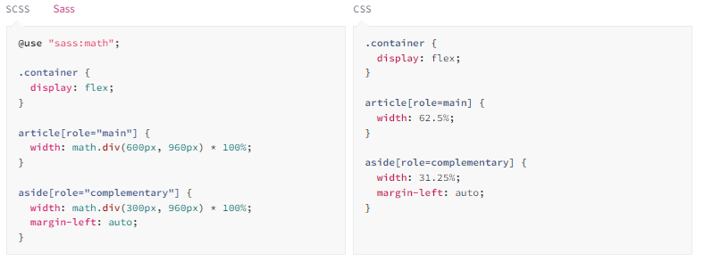

**[⬆ Back to Top](#table-of-contents)**

### What is Entity Framework Core? 

Entity Framework Core (EF Core) is an open-source object-relational mapping (ORM) framework developed by Microsoft. It is a lightweight and cross-platform version of Entity Framework (EF). EF Core is designed to work with .NET Core.

#### Main Components

`DbContext`: Represents the database session and provides a way to query and interact with the database.

`DbSet`: Represents a collection of entities in the database.

`Entity Classes`: POCO (Plain Old CLR Objects) classes that map to database tables.

`Configuration`: Fluent API or Data Annotations to configure entity properties and relationships.

`Migrations`: Used for creating and applying database schema changes.

`LINQ (Language Integrated Query)`: Used for querying data in a type-safe manner.

#### Configuration - Data Annotations

````
// Column Attribute
public class Book
{
    public int BookId { get; set; }
    [Column("Description", Order = 2, TypeName = "nvarchar(100)")]
    public string Title { get; set; }
    public Author Author { get; set; }
}

// ConcurrencyCheck Attribute
public class YourEntity
{
    public int Id { get; set; }

    [ConcurrencyCheck]
    public string Name { get; set; }
}

// DatabaseGenerated Attribute
public class Contact
{
    public int Id { get; set; }
    public string FullName { get; set; }
    public string Email { get; set; } 
    [DatabaseGenerated(DatabaseGeneratedOption.Computed)]
    public DateTime LastAccessed { get; set; }
}

````

#### Configuration - Fluent API

````
public class SampleContext : DbContext
{
    // Specify DbSet properties etc
    protected override void OnModelCreating(ModelBuilder modelBuilder)
    {
        // add your own configuration here
    }
}
````

#### Inheritance
1. Table Per Concrete (TPC)
在 TPC 策略中，每个具体类（即非抽象类）都映射到自己的表中。这意味着每个派生类的表都将包含基类的字段以及派生类特有的字段，但不会存在表之间的外键关系。
优点:
没有冗余或空列，每个表只包含它所代表的类的字段。
避免了多表连接，可能提高查询性能。
缺点:
数据重复（基类的字段在每个表中都会重复）。
更新继承层次结构的基类属性时，可能需要更新多个表。

2. Table Per Hierarchy (TPH) - Default inheritance
TPH 是 Entity Framework Core 中默认的继承映射策略。在这种策略下，一个继承层次结构（一个基类和它的所有派生类）被映射到单个数据库表中。这个表包含了所有类的字段，加上一个“Discriminator”列，用于区分不同的派生类型。
优点:
查询性能通常较好，因为所有数据都在一个表中。
模型的变化不需要复杂的数据库架构更改。
缺点:
表可能包含很多空列（对于某些派生类型不适用的属性）。
所有类共享一个表，可能会导致表过大。

3. Table Per Type (TPT)
在 TPT 策略中，每个类（基类和每个派生类）都映射到它自己的表中。派生类的表包含了派生类特有的字段，以及一个外键列，该列指向基类表的主键。
优点:
数据库模式更加归一化，没有多余的空列。
可以更灵活地处理数据和权限。
缺点:
查询性能可能较差，特别是涉及多个继承层次的查询，因为它们需要多表连接。
数据模型的变化可能需要更复杂的数据库变更。

#### Load Related Data - Lazy Loading
````
// 导航属性必须是 virtual: 这允许 Entity Framework Core 创建派生的代理实体，这些代理可以在访问导航属性时插入加载逻辑。
public class Blog
{
    public int BlogId { get; set; }
    public string Url { get; set; }
    public virtual ICollection<Post> Posts { get; set; }
}

public class Post
{
    public int PostId { get; set; }
    public string Title { get; set; }
    public string Content { get; set; }
    public int BlogId { get; set; }
    public virtual Blog Blog { get; set; }
}

// 在上面的模型中，Posts 集合和 Blog 导航属性被标记为 virtual。接下来，确保你的 DbContext 启用了代理的延迟加载：
protected override void OnConfiguring(DbContextOptionsBuilder optionsBuilder)
{
    optionsBuilder
        .UseLazyLoadingProxies()
        .UseSqlServer(myConnectionString);
}

// 当以上条件都满足时，延迟加载就可以工作了。现在，当你加载一个 Blog 实体但未明确加载其 Posts 集合时，这个集合在你第一次尝试访问它时将自动从数据库中加载：
var blog = context.Blogs.First(); // 此时不加载Posts
var postCount = blog.Posts.Count; // 此时自动从数据库加载Posts，没有 virtual 关键字，你就不会有延迟加载的功能，但你仍然可以通过其他方式加载相关数据，而且访问 .Count 会返回实际加载到集合中的元素数量，这通常默认情况下是 0。
````


#### Load Related Data - Eager Loading
````
// 当你使用 Eager Loading（立即加载）时，你是在一次数据库查询中同时加载主实体和其相关的实体。这意味着，一旦数据被检索，相关的实体将驻留在内存中，除非你的上下文被释放或实体被显式地从上下文中移除。这不是说它们“一直存在”，而是说在当前的数据上下文生命周期内，这些相关实体已经被加载并可用，你不需要再次从数据库中检索它们。
var blogs = context.Blogs
    .Include(blog => blog.Posts)
    .ToList();
````

#### Load Related Data - Explicit Loading
````
// 而对于 Explicit Loading（显式加载），事情略有不同。这种情况下，主实体首先被加载，而相关实体则是在需要的时候通过单独的查询被显式加载。就像 Eager Loading 一样，一旦这些实体被加载，它们就会在当前的数据上下文生命周期内保持在内存中。但是，与 Eager Loading 不同的是，你可以更灵活地决定何时加载这些相关实体，而不是在最初的查询中自动加载它们。
var blog = context.Blogs
    .Single(b => b.BlogId == 1);

context.Entry(blog)
    .Collection(b => b.Posts)
    .Load();
````

#### LINQ In Querying Data

Entity Framework Core uses Language-Integrated Query (LINQ) to query data from the database. LINQ allows you to use C# (or your .NET language of choice) to write strongly typed queries. It uses your derived context and entity classes to reference database objects.

````
// Loading all data
using (var context = new BloggingContext())
{
    var blogs = context.Blogs.ToList();
}

// Loading a single entity
using (var context = new BloggingContext())
{
    var blog = context.Blogs
        .Single(b => b.BlogId == 1);
}

// Filtering
using (var context = new BloggingContext())
{
    var blogs = context.Blogs
        .Where(b => b.Url.Contains("dotnet"))
        .ToList();
}
````

**[More Details](https://www.learnentityframeworkcore.com/)**

**[⬆ Back to Top](#table-of-contents)**

### What is CMS? 
A CMS, short for content management system, is a software application that allows users to build and manage a website without having to code it from scratch, or know how to code at all.

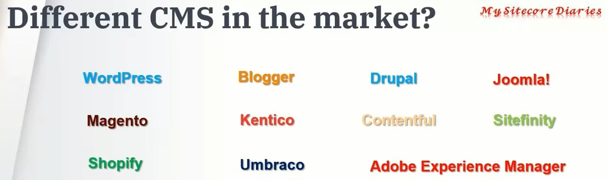

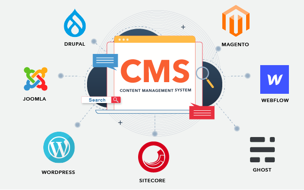

**[⬆ Back to Top](#table-of-contents)**

### What is Nextjs? 

Next.js is a React-based web framework that provides several features to help you build server-rendered React applications.

**[⬆ Back to Top](#table-of-contents)**

### Bundle and minify static assets in ASP.NET Core

Bundling and minification primarily improve the **first page request** load time. Once a web page has been requested, the browser ***caches the static assets*** (JavaScript, CSS, and images). So, bundling and minification **don't improve performance** when requesting the same page, or pages, on the same site requesting the **same assets**. If the **expires header** isn't set correctly on the assets and if bundling and minification isn't used, the browser's freshness heuristics mark the assets stale after a few days. 

#### Configure Bundles using bundleconfig.json File

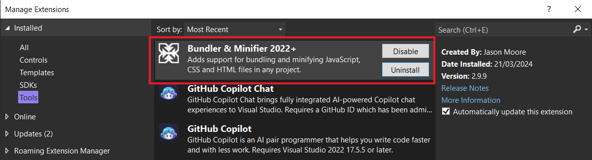

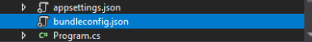

````
[
  {
    "outputFileName": "wwwroot/css/site.min.css",
    "inputFiles": [
      "wwwroot/lib/bootstrap/dist/css/bootstrap.css",
      "wwwroot/css/site.css"
    ]
  },
  {
    "outputFileName": "wwwroot/js/site.min.js",
    "inputFiles": [
      "wwwroot/js/site.js"
    ],
    "minify": {
      "enabled": true,
      "renameLocals": true
    },
    "sourceMap": false
  }
]
````

**outputFileName**: This is a required option and this specifies the name of the output bundle file. It can contain a relative path from the bundleconfig.json file.

**inputFiles**: This is an array of files we want to bundle together and it can also contain relative paths from the bundleconfig.json file. This option is not required so if you will not specify any input file, an empty output file will be generated.

**minify**: This is another **optional** setting and it specifies whether we want to enable minification or not. The default value is enabled: true.

**sourceMap**: This option indicates whether a source map for the bundled file should be generated or not. The default value is false. If this option is set to true, an additional `.map` file containing the mapping information between the original source files and the compressed file will be generated during the process of compressing and combining files.

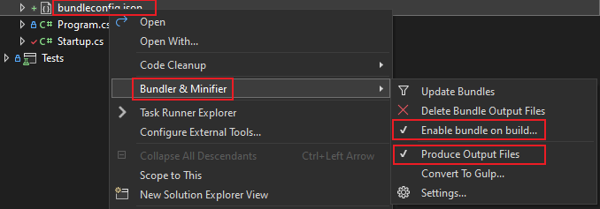

#### Environment-based Bundling and Minification

The Environment Tag Helper only renders its contents when the application is running in specific environments. The following code snippet shows how to use environment tag helper to render non-bundled files in the Development environment and bundled files when the environment is not Development such as Production or Staging.

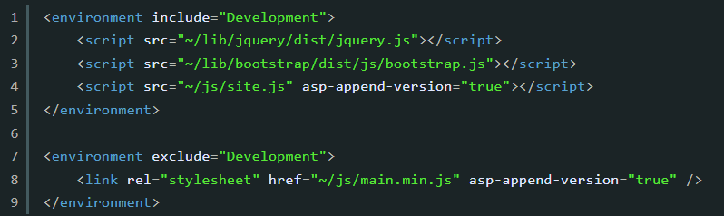

You can change your environment from Development to Production using the project properties dialog as shown in the following screenshot.

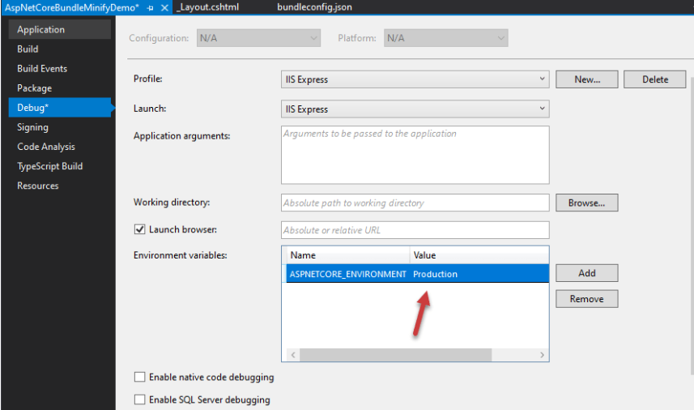


**[More Details](https://www.ezzylearning.net/tutorial/a-step-by-step-guide-to-bundling-and-minification-in-asp-net-core)**


#### Cache busting

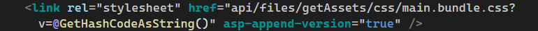

`v=@GetHashCodeAsString()`

`v=@GetHashCodeAsString()` 是一种在资源链接后添加一个查询字符串的方法，这里 GetHashCodeAsString() 应该是一个方法调用，可能是自定义的，用于生成一个哈希值或版本号。当浏览器请求带有查询参数的资源时，如果查询字符串改变了，浏览器会认为这是一个全新的资源，从而去服务器上重新下载它，而不是从缓存中加载。

`asp-append-version="true`

`asp-append-version="true"` 是一个ASP.NET Core的特定属性，它自动为静态文件的URL添加一个唯一的版本号，这个版本号是该文件内容的哈希值。当文件内容改变时，哈希值会随之改变，导致生成的URL改变，这样浏览器就会加载新版本的文件，而不是从缓存中加载旧版本。

使用 asp-append-version="true" 时，ASP.NET Core 会自动处理版本字符串的生成和添加，你不需要手动指定版本号。

**结合使用**
通常，`v=@GetHashCodeAsString()` 和 `asp-append-version="true"` 不需要一起使用。它们都是解决同一问题（缓存破坏）的不同方法：

如果你在使用ASP.NET Core，`asp-append-version="true"` 是一个简单且自动的方式来确保你的静态文件如CSS和JavaScript被正确地缓存破坏。
`v=@GetHashCodeAsString()` 这种方法更为手动，通常用在没有自动化机制的环境中，或者你需要特定的缓存控制逻辑时。

因此，一般来说，你会选择其中一种方法来实现你的需求。如果你在ASP.NET Core环境中工作，推荐使用 `asp-append-version="true"`。

**[⬆ Back to Top](#table-of-contents)**

### What is ASP.NET MVC

**[⬆ Back to Top](#table-of-contents)**

### Common HTML Events

鼠标事件
- click: 用户点击元素时触发。
- dblclick: 用户双击元素时触发。
- mousedown: 用户按下鼠标按钮时触发。
- mouseup: 用户释放鼠标按钮时触发。
- mousemove: 鼠标在元素上移动时触发。
    - 触发条件：当用户的鼠标指针在元素内部移动时，无论鼠标指针是否刚刚进入元素，mousemove 事件都会被触发。
    - 触发频率：mousemove 是一种高频事件，只要鼠标在元素上移动，就会不断触发，可以说是鼠标在元素上每移动一点点，mousemove 事件就会触发一次。
    - 使用场景：mousemove 事件通常用于跟踪鼠标的移动路径，或在用户移动鼠标时进行实时的视觉反馈。例如，在图形绘制、游戏、拖放界面或实时变化的视觉效果中经常使用mousemove事件。
- mouseover: 鼠标移入元素边界内时触发。
    - 触发条件：当用户的鼠标指针从元素外部移入元素内部时，mouseover 事件被触发。不同于mousemove，mouseover只在鼠标指针进入元素边界时触发一次。
    - 触发频率：mouseover 事件触发的频率较低，只在鼠标指针进入新的元素边界时触发。
    - 冒泡特性：mouseover 事件会冒泡。这意味着当鼠标指针移动到子元素上时，父元素也会触发mouseover事件，除非在事件处理函数中明确停止冒泡。
    - 使用场景：mouseover 通常用于实现当鼠标指针移动到某个元素上时的交互效果，如工具提示显示、颜色改变、菜单展开等。
- mouseout: 鼠标移出元素边界时触发。
- mouseout: 鼠标移出元素边界时触发。
- mouseout: 鼠标移出元素边界时触发。
- mouseenter: 鼠标移入元素时触发（不冒泡）。
- mouseleave: 鼠标移出元素时触发（不冒泡）。
- contextmenu: 用户在元素上点击鼠标右键打开上下文菜单时触发。

键盘事件
- keydown: 用户按下键盘上的任意键时触发。
- keyup: 用户释放键盘上的键时触发。
- keypress: 用户按下键盘上的字符键时触发（已废弃，不推荐使用）。

焦点事件
- focus: 元素获得焦点时触发。
- blur: 元素失去焦点时触发。
- focusin: 元素或其子元素获得焦点时触发（会冒泡）。
- focusout: 元素或其子元素失去焦点时触发（会冒泡）。

触摸事件
- touchstart: 用户触摸屏幕时触发。
- touchmove: 用户在屏幕上滑动时触发。
- touchend: 用户停止触摸屏幕时触发。
- touchcancel: 触摸事件被打断时触发，例如电话呼入或弹出警告框。

滚动事件
- scroll: 元素或窗口滚动时触发。

拖拽事件
- dragstart: 用户开始拖动元素时触发。
- drag: 元素被拖动时连续触发。
- dragend: 拖动操作结束时触发。
- dragenter: 拖动的元素进入有效放置目标时触发。
- dragover: 元素被拖动到有效放置目标上时连续触发。
- dragleave: 拖动的元素离开有效放置目标时触发。
- drop: 元素被拖动到有效放置目标上并释放时触发。

动画和过渡事件
- animationstart: CSS动画开始时触发。
- animationend: CSS动画结束时触发。
- animationiteration: CSS动画重复时触发。
- transitionend: CSS过渡效果完成时触发。

**[⬆ Back to Top](#table-of-contents)**

### Content Delivery API

A Content Delivery API is a specific type of API designed to allow developers and applications to retrieve content from a Content Management System (CMS). This kind of API is particularly designed for use in "headless" or "decoupled" CMS architectures, where the CMS is used solely for storing and managing content, while the presentation and delivery of content are handled by other systems or front-end frameworks.

In a headless architecture, the Content Delivery API plays a crucial role as it provides a standardized way to request and receive content. This enables front-end developers to use any technology or framework of their choice to build the user interface while relying on the structured content provided by the CMS through the API.

**[tutorial-video](https://www.youtube.com/watch?v=moI4cIxKIMc)**

**[⬆ Back to Top](#table-of-contents)**