# FrontEnd Framework Learning
> 🦄 Only based on my own understanding 🦄

### Table of Contents
| Feature | Vuejs | Reactjs | Angular |
| ------- | ----- | ------- | ------- | 
| State Management | Vux | Redux | NgRx/RxJS | 
| Property Binding |  Directive: `v-bind` <br> Example: `` <br> Shorthand: `` | Expression: `{}` <br> Example: ``| Expression: `[]` <br> Example: `` |
| Structural Directive (For) | Directive: `v-for` <br> Example: 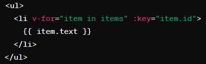 | Directive: `array.map()` <br> Example: 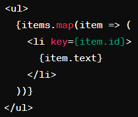 | Directive: `*ngFor` <br> Example: 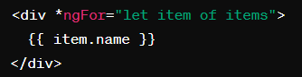 |
| Structural Directive (If) |  Directive: `v-if` <br> Example:  | Directive: Ternary operation <br> Example: 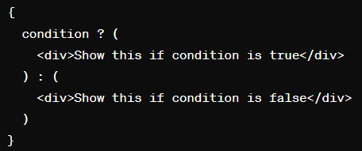 | Directive: `*ngIf` <br> Example: 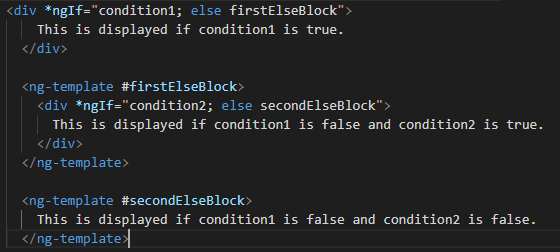 |
| Event Handling | Directive: `v-on` <br> Example: `<button on:click="handleClick">Click Me</button>` <br> Shorthand: `<button @click="handleClick">Click Me</button>` | Expression: `{}` <br> Example: `<button onClick={handleClick}>Click Me</button` | Expression: `(useEffect)` <br> Example: `<button (click)="handleClick()">Click Me</button>` |
| Obtain and manage data dynamically | `Computed`/`Watch` | `useState`/`useEffect` | `get` | 
| Parent to Child | Parent: 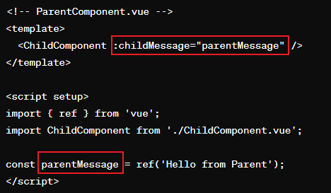 <br> Child: 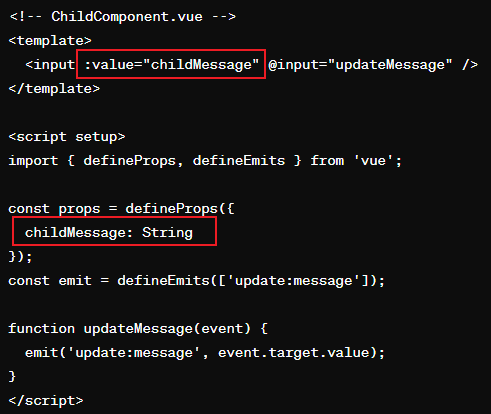 | Parent: 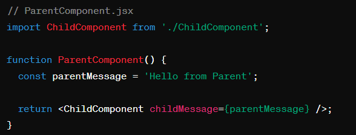 <br> Child: 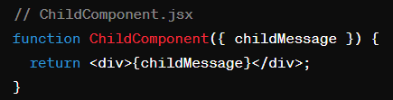 | Parent: 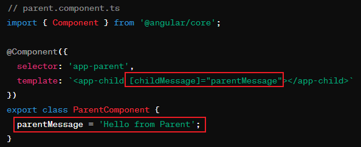 <br> Child: 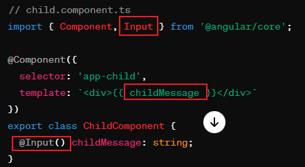 | 
| Child to Parent | Parent: 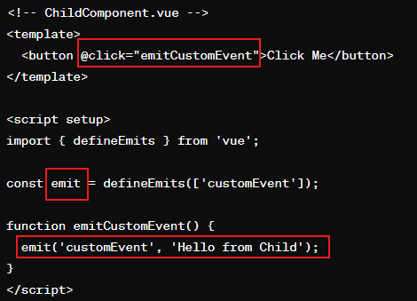 <br> Child: 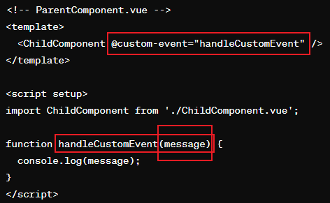 | Parent:  <br> Child: 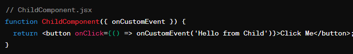 | Parent: 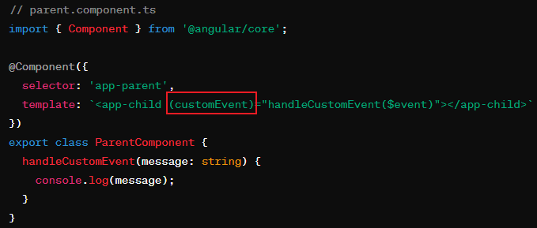 <br> Child: 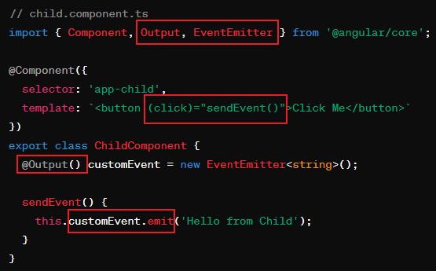 |

| Testing | --- | --- | [spec.ts](#spects) | 


### spec.ts

`spec.ts` 文件是一个用于单元测试的测试规范文件，在Angular项目中由Angular CLI 自动生成。这个文件包含了针对相应组件的测试代码，用于确保组件按照预期工作。

**用途**
- 单元测试：`spec.ts` 文件用于定义单元测试，它们检查组件的各个部分（如类、函数、其他方法）在隔离环境下是否正确执行。
- 自动化测试：单元测试可以被自动化执行，这意味着你可以在代码修改后自动运行这些测试，确保更改没有破坏现有功能。

**组成**
在Angular中，单元测试通常使用[Jasmine测试框架](#jasmine-testing-framework)编写，结合[Karma](#karma)测试运行器来执行。一个典型的spec.ts文件可能看起来像这样：

````
import { ComponentFixture, TestBed } from '@angular/core/testing';
import { MyComponent } from './my.component';

describe('MyComponent', () => {
  let component: MyComponent;
  let fixture: ComponentFixture<MyComponent>;

  beforeEach(async () => {
    await TestBed.configureTestingModule({
      declarations: [ MyComponent ]
    })
    .compileComponents();
  });

  beforeEach(() => {
    fixture = TestBed.createComponent(MyComponent);
    component = fixture.componentInstance;
    fixture.detectChanges();
  });

  it('should create', () => {
    expect(component).toBeTruthy();
  });
});

````

在这个例子中：
- `describe` 函数定义了一组相关的测试，这里是针对MyComponent组件的测试。
- `beforeEach` 函数包含了在每个测试开始前执行的代码，通常用于设置测试环境，如创建组件实例。
- `it` 函数定义了一个单独的测试，例如检查组件是否能够成功创建。

**重要性**
- 质量保证：通过单元测试，可以验证代码的各个部分是否按预期工作，这对于保证软件质量非常重要。
- 回归测试：当修改或扩展代码时，单元测试可以帮助确保你的更改没有破坏现有功能，这是回归测试的一个重要方面。
- 文档作用：测试代码也充当了一种文档形式，说明了代码的预期行为。

**[⬆ Back to Top](#table-of-contents)**

### Jasmine Testing Framework

Jasmine是一个行为驱动开发（BDD）的测试框架，用于JavaScript编程语言。它不依赖于任何其他JavaScript框架，并且不需要DOM。Jasmine的主要特点和功能包括：

- 独立性：Jasmine不依赖于任何浏览器、DOM或任何JavaScript框架，使其适用于任何JavaScript应用。
- 描述性语法：它提供了易于阅读的语法，允许开发者以自然语言描述测试套件和测试用例。
- 丰富的断言库：Jasmine包含大量的内置断言（称为“匹配器”），这些断言可以用来测试不同类型的条件和结果。
- 支持测试双：包括spies, stubs和mocks，用于跟踪函数调用，模拟函数行为和管理函数返回值。

示例：
````
describe('MyComponent', () => {
  it('should add two numbers', () => {
    let result = 1 + 2;
    expect(result).toEqual(3);
  });
});
````

在这个例子中，`describe`函数定义了一个测试套件，`it`函数定义了一个具体的测试用例，而expect函数则是一个断言，用于验证测试结果是否符合预期。

**[⬆ Back to Prev](#spects)**

### Karma

Karma是一个测试运行器，它可以启动一个浏览器，加载测试代码，并执行测试。Karma的主要特点和功能包括：

- 多浏览器测试：Karma可以在多种浏览器中运行测试，包括Chrome、Firefox、Safari、IE等。
- 自动化测试：Karma可以监视文件变化，并在文件被修改后自动重新运行测试，这对于开发过程中的测试非常有用。
- 集成：Karma易于与其他工具如Jasmine, Mocha, QUnit等集成，也可以与持续集成工具如Jenkins, Travis CI等配合使用。
- 插件系统：提供了丰富的插件，可以扩展Karma的功能，比如生成代码覆盖率报告。

Karma通常用于单元测试和端到端测试，它的运行环境是浏览器，这使得测试的执行环境与实际的用户环境更为接近。

**[⬆ Back to Prev](#spects)**